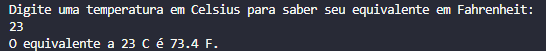

<h1 align="center">Convertor de temperaturas 🌡</h1>
<p align="center">
  
</p>

## :books: Informações
"Escreva um programa que converte temperaturas de Celsius para Fahrenheit. Fórmula ( 0 °C ×
9 / 5 ) + 32 = 32 °F."<br/><br/>
Exemplo:

```
Entre com uma temperatura em Celsius para saber seu equivalente em Fahrenheit:
22
O equivalente a 22 C é 71,6 F.
```

## :bookmark_tabs: Conclusão
Um simples projeto que recebe um valor e no resultado é usado uma fórmula para calcular a conversão em Fahrenheit. Declarei " float grau; ", porém no resultado coloquei como "(int) grau" para não aparecer o número decimal (.0).

## :pushpin: Tecnologias
<ul>
  <li><a href="https://docs.oracle.com/javase/tutorial/">Java</a></li>
  <li><a href="https://www.devmedia.com.br/como-funciona-a-classe-scanner-do-java/28448">Classe Scanner</a></li>
</ul>
