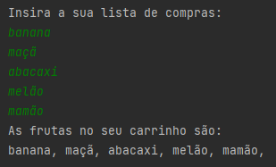

<h1 align="center">Lista de frutas 🍇</h1>
<p align="center">
  
</p>

## :books: Informações
"Escreva um programa que lê o nome de 5 frutas e armazena num carrinho de compras. Ao final
da entrada dos 5 itens, exiba a lista completa."<br/><br/>
Exemplo:

```
Insira a sua lista de compras:
banana
maçã
abacaxi
melão
mamão

As frutas no seu carrinho são:
banana, maçã, abacaxi, melão, mamão
```

## :bookmark_tabs: Conclusão
Um projeto que adiciona informações no Array e imprime o total após completar os 5 elementos.

## :pushpin: Tecnologias
<ul>
  <li><a href="https://docs.oracle.com/javase/tutorial/">Java</a></li>
  <li><a href="https://www.devmedia.com.br/como-funciona-a-classe-scanner-do-java/28448">Classe Scanner</a></li>
</ul>
