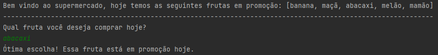

<h1 align="center">Supermercado de frutas 🍉</h1>
<p align="center">
  
</p>

## :books: Informações
"Um supermercado anuncia diariamente uma lista com 5 frutas em promoção. Escreva um
programa que recebe o nome de uma fruta que você deseja comprar e informa se a fruta
pertence à lista de promoções."<br/><br/>
Exemplo:

```
A lista de frutas em promoção é: [banana, maçã, abacaxi, melão, mamão].

Qual fruta você deseja comprar hoje?

banana

Ótima escolha! Essa fruta está em promoção hoje.
```

## :bookmark_tabs: Conclusão
Um projeto que utiliza informações definidas no Array para verificar se o produto escolhido está em promoção.

## :pushpin: Tecnologias
<ul>
  <li><a href="https://docs.oracle.com/javase/tutorial/">Java</a></li>
  <li><a href="https://www.devmedia.com.br/como-funciona-a-classe-scanner-do-java/28448">Classe Scanner</a></li>
  <li><a href="https://www.devmedia.com.br/trabalhando-com-arrays-em-java/25530">Classe Array</a></li>
</ul>
