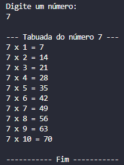

<h1 align="center">✖ Tabuada de multiplicação ✖</h1>
<p align="center">
  
</p>

## :books: Informações
"Escreva um programa que informa a tabuada de multiplicação de um número informado pelo
usuário (entre 1-10)."<br/><br/>
Exemplo:

```Entre com um número de 1 a 10:
Entre com um número de 1 a 10:
1
A tabuada de 1 é:
1 x 1 = 1
1 x 2 = 2
1 x 3 = 3
…
```

## :bookmark_tabs: Conclusão
Um simples projeto utilizando estrutura de repetição "for".

## :pushpin: Tecnologias
<ul>
  <li><a href="https://docs.oracle.com/javase/tutorial/">Java</a></li>
  <li><a href="https://www.devmedia.com.br/como-funciona-a-classe-scanner-do-java/28448">Classe Scanner</a></li>
</ul>
